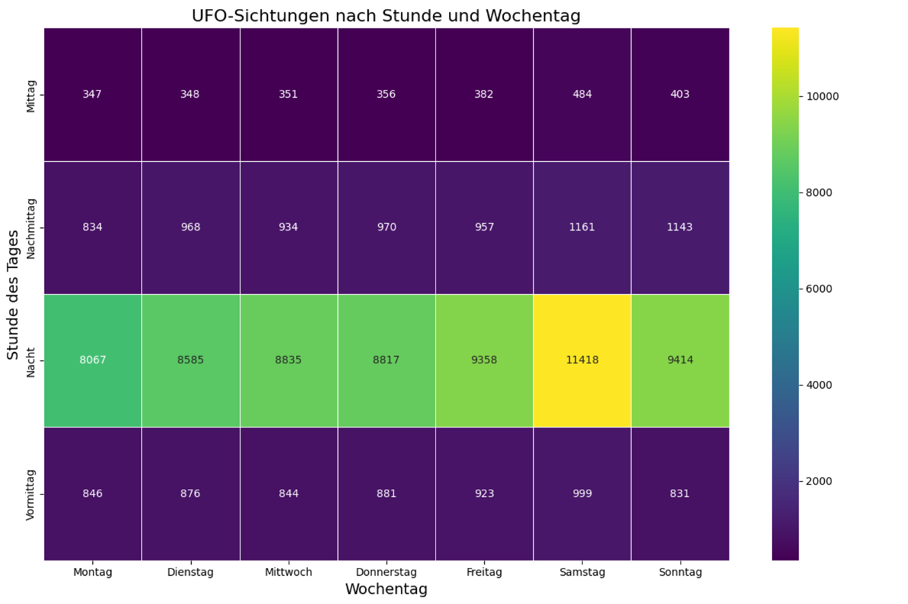
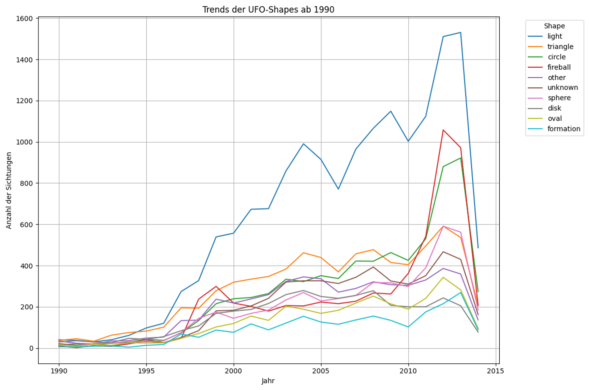
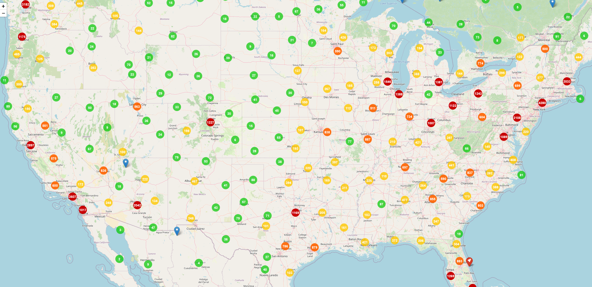
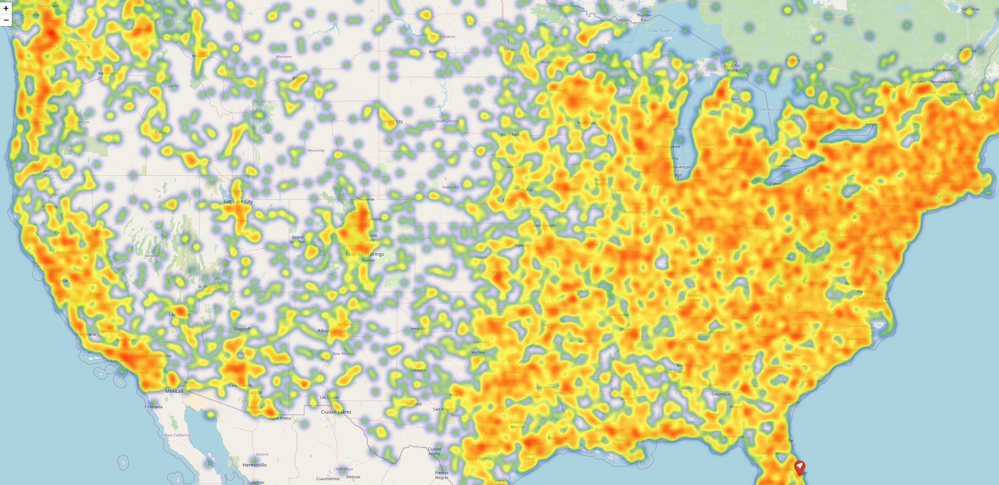

> ⚠️ Dieses Projekt dient ausschließlich zu Lern- und Demonstrationszwecken.


# Praxisprojekt_02_UFO_Sichtungen

Ein Skript, das einen Datensatz mit UFO Sichtungen analysiert und 
Ergenisse im Form von Grafiken und interaktiven Karten ausgibt.
Dieses Projekt dient als Praxis- und Lernprojekt zur Erstellung von Visualisierungen mit Python.

---

## Projektbeschreibung

In diesem Projekt wurde ein öffentlicher Datensatz zu UFO-Sichtungen von Kaggle verwendet, um die Grundlagen der explorativen Datenanalyse und Datenvisualisierung in Python zu üben.  

Ein Skript lädt dabei die Rohdaten, bereinigt sie und führt mehrere Analyse-Aspekte durch, darunter zeitliche Entwicklungen, Daueranalysen und die Verteilung unterschiedlicher Sichtungsarten. Die erzeugten Grafiken werden in `data/data_visualisation/` abgelegt.  

Als zusätzliches Highlight werden mit der Bibliothek Folium interaktive Karten erstellt, die z. B. Sichtungen an besonderen Tagen (z. B. Independence Day 2010, Perseiden oder Leoniden-Meteorströme) oder in bestimmten Regionen (z. B. Area 51) geografisch darstellen.

---

## Analyse-Schwerpunkte

- Zeitliche Entwicklung der UFO-Sichtungen
- Häufigkeit und Verteilung verschiedener UFO-Formen
- Analyse der Sichtungsdauer
- Analyse innerhalb einens Umkreises von Area 51
- Interaktive Kartendarstellung mit Folium

## Screenshots

### Tage und Tagesabschnitte



### Sichtungen an Feiertagen


### Verteilung der UFO Formen ab 1990 (Datensatz bis 2014)



### Interaktive Karte (Cluster)



### Interaktive Karte (Heatmap)




---


## Technologien

-   Python
-   Numpy
-   Pandas
-   geopandas
-   matplotlib
-   seaborn
-   folium

---

## Projektstruktur

```text
.
├── main.py
├── README.md
├── requirements.txt
├── data/
|   ├── data_clean/
|   ├── data_map/
|   ├── data_raw/
|   ├── data_visualisation/
|   |   └── summaries/
|   └── shapes_from_natural_earth/
|       └── ne_10m_admin_0_countries/
├── functions/
├── logs/
└── scripts/

```

| Ordner / Datei | Beschreibung |
|----------------|-------------|
| `main.py` | Einstiegspunkt der Anwendung |
| `data/data_raw/` | Originaldaten (Kaggle Dataset) |
| `data/data_clean/` | Bereinigte und transformierte Datensätze |
| `data/data_map/` | Generierte Folium-Karten |
| `data/data_visualisation/summaries` | Zusammenfassung der exportierten Visualisierungen |
| `data/data_visualisation/` | Exportierte Visualisierungen |
| `data/shapes_from_natural_earth/ne_10m_admin_0_countries/` | Natural Earth Vector Shapefiles (Ländergrenzen) |
| `functions/` | Wiederverwendbare Funktionen für Datenaufbereitung und Analyse |
| `scripts/` | Analyseskripte |
| `logs/` | Laufzeit- und Debug-Logs |

---

## Voraussetzungen

-   Python 3.11+

---

## Installation & Ausführung

### Repository klonen

``` bash
git clone https://github.com/Pydatrick/Praxisprojekt_02_UFO_Sichtungen.git
cd Praxisprojekt_02_UFO_Sichtungen
```

### Virtuelle Umgebung erstellen

``` bash
python -m venv venv
venv\Scripts\activate   # Windows
source venv/bin/activate  # Linux/Mac
```

### Abhängigkeiten installieren

``` bash
pip install -r requirements.txt
```

### Dataset von Kaggle laden

Das Dataset (Version 1) kann hier heruntergeladen werden:  
https://www.kaggle.com/datasets/sahityasetu/ufo-sightings  

Nach dem Download bitte die Datei in den Ordner `data/data_raw/` kopieren.

### Natural Earth 10m Cultural Vector Shapefiles

Verwendet wurden die **Natural Earth Vector Shapefiles (Version 5.1.1)**  
https://www.naturalearthdata.com/downloads/10m-cultural-vectors/

Benötigt wird:
- `ne_10m_admin_0_countries`

Nach dem Entpacken bitte in folgenden Ordner ablegen:
`data/shapes_from_natural_earth/ne_10m_admin_0_countries/`

Die Shapefiles enthalten die Ländergrenzen im Maßstab 1:10m.

### Skript starten

```bash
python main.py
```

---